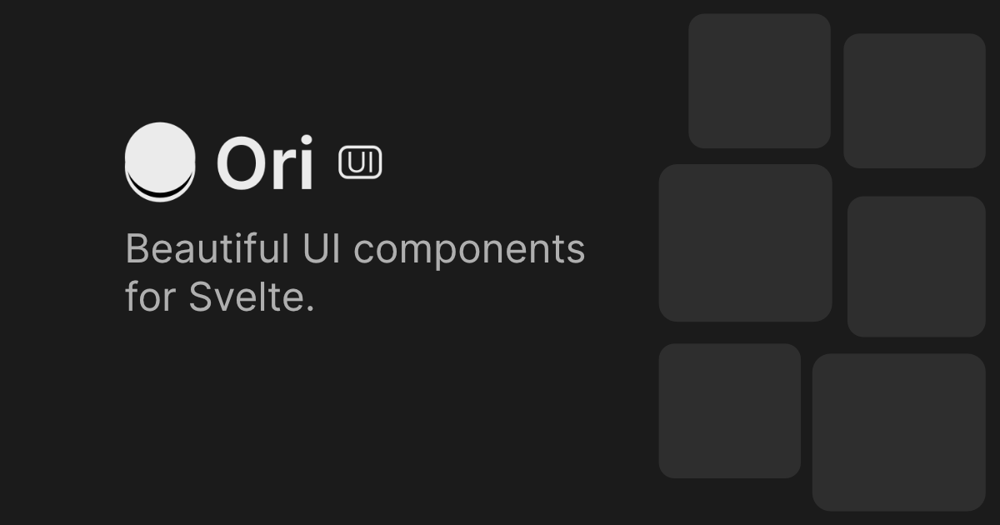

  

  # Ori UI for Svelte

  

    <strong>Beautiful, copy-paste UI components for Svelte.</strong>
     
    Build stunning websites without worrying about complex styling and animations.
  

  

    <a href="https://ori-ui.vercel.app/docs"><strong>Explore Documentation »</strong></a>
     
     
    
    
    
  

---

## ✨ Features

Ori UI allows you to grab the most trending web components and drop them straight into your Svelte projects.

* 🚀 **Copy & Paste:** No heavy library to install. Just take the code you need.
* 🎨 **Modern Design:** Heavily inspired by the "Linear" and "Dark Mode" aesthetic.
* ⚡ **Svelte Native:** Optimized for Svelte and SvelteKit performance.
* 🧩 **Tailwind Powered:** Easy to customize using the utility classes you already know.

## 📖 Documentation

Visit our official site for full installation guides and interactive previews:
👉 **[https://oriui.app/docs](https://oriui.app/docs)**